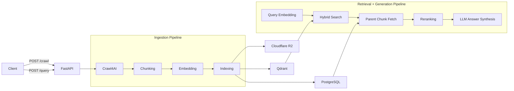

# RAG Project

A Retrieval-Augmented Generation (RAG) pipeline service built with FastAPI. Crawls websites, chunks and embeds content using a parent-child hierarchy, and retrieves relevant context via hybrid search with cross-encoder reranking.

## Table of Contents

- [Architecture](#architecture)
  - [Ingestion Pipeline](#ingestion-pipeline)
  - [Retrieval and Generation Pipeline](#retrieval-and-generation-pipeline)
- [Design Decisions](#design-decisions)
- [Data Model](#data-model)
- [ML Models](#ml-models)
- [Project Structure](#project-structure)
- [Development](#development)
  - [Tools](#tools)
  - [CI/CD](#cicd)
- [Getting Started](#getting-started)
  - [Prerequisites](#prerequisites)
  - [Environment Configuration](#environment-configuration)
  - [Local Development (without Docker)](#local-development-without-docker)
  - [Docker Development (with hot-reload)](#docker-development-with-hot-reload)
  - [Production](#production)
  - [Smoke Test](#smoke-test)
  - [Usage](#usage)
- [TODO](#todo)

## Architecture

The codebase follows a four-layer structure where each layer only depends on the layer(s) below it:

```
API  →  Pipelines  →  Services  →  Infrastructure
```

| Layer | Directory | Responsibility |
|---|---|---|
| **API** | `app/api/` | REST API routes, request/response schemas |
| **Pipelines** | `app/pipelines/` | Orchestrate multi-step workflows |
| **Services** | `app/services/` | Single-responsibility business logic |
| **Infrastructure** | `app/infra/` | External system clients and initialization |



### Ingestion Pipeline

Triggered via `POST /crawl`. The request flows from `app/api/routes/crawl.py` into `app/pipelines/ingestion.py`:

1. **Crawling** (`app/services/crawling.py`) -- BFS deep crawl via Crawl4AI with a headless browser, pruning content filter, and max depth of 3.
2. **Content-hash check** (`app/pipelines/ingestion.py`) -- SHA-256 hash comparison against the existing document in PostgreSQL to skip unchanged content.
3. **Chunking** (`app/services/chunking.py`) -- Two-level hierarchical chunking with Chonkie. Parent chunks (1024 tokens) carry prefix/suffix overlap context; child chunks (256 tokens) are created from each parent.
4. **Embedding** (`app/services/embedding.py`) -- Dense (BAAI/bge-base-en-v1.5) + sparse (SPLADE PP) embeddings via FastEmbed.
5. **Indexing** (`app/services/indexing.py`) -- Three-store write with retry via tenacity:
   - **Cloudflare R2** -- raw markdown content
   - **Qdrant** -- child chunk vectors (dense + sparse, scalar INT8 quantization)
   - **PostgreSQL** -- `Document` and `ParentChunk` records via SQLModel
6. **Stale-data cleaning** -- On content change, deletes old vectors from Qdrant and old parent chunks from PostgreSQL before upserting the updated data.

### Retrieval and Generation Pipeline

The query flow is exposed via `POST /query/` in `app/api/routes/query.py`. It orchestrates retrieval and answer generation:

1. **Query Embedding** -- Same dual-encoder as ingestion (dense + sparse).
2. **Hybrid Search** (`app/services/searching.py`) -- Qdrant's `query_points_groups` with dense + sparse prefetch, RRF fusion, grouped by `parent_id`.
3. **Parent Chunk Fetch** -- Loads full parent chunk texts from PostgreSQL by the IDs returned from search.
4. **Reranking** (`app/services/reranking.py`) -- Cross-encoder (Jina Reranker v1 Turbo) re-scores candidates and returns the top-k (3) parent chunks.
5. **Generation** (`app/pipelines/generation.py`) -- Synthesizes a grounded answer from retrieved context and returns citations (`parent_chunk_id`, `document_id`, `source_url`).

If `GEMINI_API_KEY` is not set or generation fails, the pipeline returns a deterministic fallback answer built from the top retrieved context.

## Design Decisions

- **Parent-child chunking** -- Embedding smaller child chunks improves search precision, while retrieving the larger parent chunks provides richer context for downstream generation. Prefix/suffix overlap between parents avoids information loss at chunk boundaries.
- **Hybrid search with RRF** -- Combining dense and sparse retrieval covers both meaning-based and keyword-based queries. Reciprocal Rank Fusion balances both signals without requiring weight tuning. Grouping by `parent_id` deduplicates results when multiple child chunks from the same parent match.
- **Cross-encoder reranking** -- Bi-encoder retrieval is fast but approximate; a cross-encoder rescoring step significantly improves relevance at the cost of latency, applied only to the small candidate set returned by hybrid search.
- **Content-hash deduplication** -- Comparing page hashes before processing avoids redundant chunking, embedding, and indexing on re-crawls when content hasn't changed.
- **Stale-data cleanup** -- Deleting old vectors and chunks before upserting prevents orphaned data from accumulating when page content changes.
- **Scalar quantization** -- FLOAT16 storage with INT8 quantization reduces memory footprint while oversampling (2.5x) during search compensates for precision loss.
- **Deterministic UUIDs** -- `uuid5(NAMESPACE_URL, ...)` generates stable, reproducible IDs from content keys, making upserts idempotent.
- **Retry with backoff** -- Transient failures in external stores are handled gracefully with exponential backoff without failing the entire pipeline.

## Data Model

**Relational DB (SQLModel tables):**
- **`Document`** -- page metadata: `id` (UUID5 from URL), `title`, `content_key`, `content_hash` (SHA-256), `source_url`, `scraped_at`.
- **`ParentChunk`** -- full text of a document section with prefix/suffix overlap context, foreign key to `Document` (cascade delete).

**Vector DB (Qdrant point payloads):**
- Each point is a child chunk embedding carrying `parent_id` and `document_id` in its payload.

**In-memory (Pydantic models):**
- **`Chunk`** -- transient representation during chunking: `id`, `text`, `parent_id`, `child_ids`.
- **`Embedding`** -- dense `list[float]` + sparse `SparseVector` pair.

## ML Models

All models run locally via FastEmbed. Inference is dispatched via `asyncio.to_thread()` to avoid blocking the event loop.

| Purpose | Model | Type |
|---|---|---|
| Dense embedding | `BAAI/bge-base-en-v1.5` | Bi-encoder |
| Sparse embedding | `prithivida/Splade_PP_en_v1` | Learned sparse |
| Reranking | `jinaai/jina-reranker-v1-turbo-en` | Cross-encoder |
| Tokenizer | Splade PP tokenizer (shared with chunking) | WordPiece |

## Project Structure

```
app/
  main.py              # FastAPI entrypoint + lifespan
  config.py            # Central configuration constants
  models.py            # SQLModel / Pydantic data models
  logging_config.py    # Logging setup
  api/
    main.py            # Router aggregator
    schemas.py         # Request/response models
    routes/crawl.py    # POST /crawl endpoint
    routes/query.py    # POST /query endpoint
  pipelines/
    ingestion.py       # Crawl result -> chunk -> embed -> index
    retrieval.py       # Query -> embed -> search -> rerank
    generation.py      # Retrieve context -> generate answer + citations
  services/
    crawling.py        # BFS web crawling
    chunking.py        # Parent-child chunking
    embedding.py       # Dense + sparse embedding
    indexing.py        # Three-store indexing with retry
    searching.py       # Hybrid vector search
    reranking.py       # Cross-encoder reranking
  infra/
    postgres.py        # PostgreSQL async engine + session
    qdrant.py          # Qdrant async client + collection init
    cfr2.py            # Cloudflare R2 S3 client
scripts/
  smoke_crawl.py       # Standalone crawl+ingest script
  smoke_retrieve.py    # Standalone retrieval smoke test
tests/                 # Pytest suite with in-memory stubs
```

## Development

### Tools

- **Pre-commit hooks** (`.pre-commit-config.yaml`): ty check, ruff check with auto-fix, ruff format, commitizen conventional commit message validation.
- **Commitizen** for conventional commits and versioned changelog generation.

### CI/CD

Defined in `.github/workflows/ci.yaml`. Runs on push to `main`, version tags, and pull requests:

1. **Lint** -- ty type check, Ruff lint, Ruff format check.
2. **Test** -- pytest with JUnit report and coverage comment on PRs.
3. **Build** -- Multi-stage Docker build with BuildKit caching. Pushes to Docker Hub on `main` and version tags (skipped for PRs).

## Getting Started

### Prerequisites

- Python 3.12+
- [uv](https://docs.astral.sh/uv/) package manager
- Docker and Docker Compose (for containerized workflows)
- Cloudflare R2 account (object storage)
- Qdrant Cloud instance or self-hosted Qdrant
- PostgreSQL 16 (or provided via Docker)

### Environment Configuration

Copy `.env.example` to `.env` and fill in the values:

```bash
cp .env.example .env
```

| Variable | Description |
|---|---|
| `APP_PORT` | Host port for the production app container |
| `DEV_PORT` | Host port for the dev app container |
| `POSTGRES_USER` | PostgreSQL username |
| `POSTGRES_PASSWORD` | PostgreSQL password |
| `POSTGRES_DB` | PostgreSQL database name |
| `POSTGRES_URL` | Full async connection string (`postgresql+asyncpg://...`) |
| `QDRANT_URL` | Qdrant instance URL |
| `QDRANT_API_KEY` | Qdrant API key |
| `R2_ACCOUNT_ID` | Cloudflare account ID |
| `R2_ACCESS_KEY_ID` | R2 access key ID |
| `R2_SECRET_ACCESS_KEY` | R2 secret access key |

### Local Development (without Docker)

```bash
uv sync                    # Install all dependencies
cp .env.example .env       # Configure environment variables
fastapi dev app/main.py    # Start dev server with hot-reload
```

### Docker Development (with hot-reload)

```bash
cp .env.example .env
docker compose -f compose.dev.yaml up --build
```

- Builds via `Dockerfile.dev` and mounts `app/` and `tests/` for hot-reload.
- Includes PostgreSQL from `infra.yaml`.

### Production

```bash
cp .env.example .env
docker compose up -d
```

- Pulls the pre-built image `f00hy/rag-app:main`.
- Includes PostgreSQL from `infra.yaml`.

### Smoke Test

Run smoke scripts outside the API server to validate each stage:

```bash
uv run python scripts/smoke_crawl.py <url> --max-pages 5
```

```bash
uv run python scripts/smoke_retrieve.py "<query>" --limit 5
```

### Usage

With the server running, first crawl and index at least one source:

```bash
curl -w "\n" \
  -X POST http://localhost:8000/crawl/ \
  -H "Content-Type: application/json" \
  -d '{
    "url": "https://docs.astral.sh/uv",
    "max_pages": 3
  }'
```

Then query the indexed data:

```bash
curl -w "\n" \
  -X POST http://localhost:8000/query/ \
  -H "Content-Type: application/json" \
  -d '{
    "query": "What is uv?"
  }'
```

If you query before crawling, the response can contain empty retrieval context and a fallback answer.

## TODO
- [ ] Testing & Performance Evaluation
